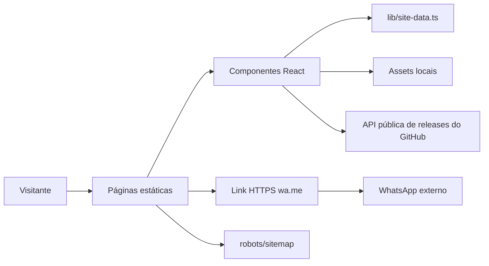

# Documentação completa — site comercial Orçamentos Simplificados

> ← Voltar para [DOCUMENTACAO_MESTRE.md](../DOCUMENTACAO_MESTRE.md)

Esta source é o site público de apresentação, download, planos, guia e documentos legais. Ela não contém autenticação, banco, checkout, API própria, Supabase ou capacidade de emitir licença. Botões comerciais abrem o WhatsApp com mensagem pré-preenchida. O botão de download consulta somente a API pública de releases do GitHub e possui fallback para a página oficial da versão estável mais recente.

## Índice

1. [Estado e arquitetura](#1-estado-e-arquitetura)
2. [Rotas e fluxo](#2-rotas-e-fluxo)
3. [Configuração comercial](#3-configuração-comercial)
4. [Componentes e estilos](#4-componentes-e-estilos)
5. [Arquivos e assets](#5-arquivos-e-assets)
6. [Build, hospedagem e ambiente](#6-build-hospedagem-e-ambiente)
7. [Segurança, privacidade e riscos](#7-segurança-privacidade-e-riscos)
8. [Guia de manutenção](#8-guia-de-manutenção)

# 1. Estado e arquitetura

| Item | Estado confirmado |
|---|---|
| Framework de autoria | Next.js App Router 16.2.11 + React 19.2.6 |
| Runtime/build usado | Vinext 1.0.0-beta.3 + Vite 8.0.13, integração Cloudflare/OpenAI Sites |
| Renderização | `dynamic = "force-static"`; páginas estáticas |
| Versão documentada localmente | `8.3.0` em `lib/site-data.ts` |
| Download público | release estável mais recente de `GabrielSchmeisk/Orcamentos-Atualizacoes` |
| Compra | contato assistido por `wa.me`; nenhuma cobrança no site |
| Dados coletados | nenhum formulário ou endpoint de coleta identificado |
| Auth/API/db | não existem nesta source |
| Assets | locais em `public/`, usados por `next/image`/paths normalizados |



Não existe fluxo site→Supabase. Textos sobre sincronização/licenciamento descrevem o produto desktop; eles não concedem ao site acesso técnico a esses sistemas.

# 2. Rotas e fluxo

| Rota | Arquivo | Conteúdo/efeito |
|---|---|---|
| `/` | `app/page.tsx` | Hero, download da versão estável, recursos, diferenciais, telas reais, proteção/continuidade e CTAs. |
| `/recursos` | `app/recursos/page.tsx` | Grupos completos, microfunções, preview e links ao guia. |
| `/planos` | `app/planos/page.tsx` | Teste, preços, comparação, ativação por chave e fallback assistido `.orcrequest`→`.orclicense`; CTAs WhatsApp. |
| `/guia` | `app/guia/page.tsx` | Manual pesquisável da versão indicada em `PRODUCT`. |
| `/faq` | `app/faq/page.tsx` | Compatibilidade, dados, licença, update e suporte. |
| `/privacidade` | `app/privacidade/page.tsx` | Política sobre site/app/licenciamento/sync e dados pessoais. |
| `/termos` | `app/termos/page.tsx` | Condições de uso, licença, responsabilidade e updates. |
| `/robots.txt` | `app/robots.ts` | Regras de crawler geradas. |
| `/sitemap.xml` | `app/sitemap.ts` | URLs/canonical do site. |

`app/layout.tsx` é o shell: metadata global, favicon/OG, idioma, Bootstrap Icons, header/footer, movimentos e back-to-top. Cada página define metadata e canonical relativo. Não há middleware, route handler ou Server Action. A única consulta remota do navegador é um `GET` sem credenciais à release pública mais recente no GitHub, iniciado quando o visitante escolhe baixar o app.

Fluxo comercial:

```text
visitante lê recurso/plano
→ CTA usa PRODUCT.purchaseLink/trialLink/contactLink
→ whatsappLink codifica texto com encodeURIComponent
→ navegador abre https://wa.me/<número>?text=<mensagem>
→ usuário decide enviar no WhatsApp
```

O site não sabe se a mensagem foi enviada e não registra conversão. Qualquer analytics futuro deve ser documentado e avaliado em privacidade antes de incluir.

# 3. Configuração comercial

`lib/site-data.ts` é a fonte central:

| Campo/estrutura | Efeito |
|---|---|
| `SITE_CONFIG.siteUrl` | canonical, robots e sitemap quando consumido; conferir com env/config de build. |
| `whatsappNumber`, `whatsappDisplay` | destino técnico e texto exibido. |
| `productVersion` | guia, recursos, screenshots e CTAs. |
| `platform` | compatibilidade anunciada. |
| `PRODUCT` | nome, versão, links de compra/contato/teste e display. |
| `plans` | nome, preço, descrição, destaque/badge e link com mensagem específica. |
| `resourceGroups` | grupos, textos, ícones e itens das páginas. |
| helpers de asset/link | base path e encoding correto. |

Não existe checkout: mudar preço altera apenas texto/mensagem. O valor final continua uma negociação externa. Ao mudar versão ou recursos, revisar também screenshots, guia, FAQ, termos/privacidade e versão real do instalador. O site documenta o cliente atual `8.3.0`, enquanto o botão de download entrega sempre a última release estável publicada.

# 4. Componentes e estilos

| Arquivo | Execução e responsabilidade |
|---|---|
| `app/components/site-header.tsx` | Client component; menu responsivo, rota ativa e CTAs. Estado local apenas. |
| `app/components/download-app-button.tsx` | Resolve a release estável via API pública do GitHub, valida o host/asset `.exe` e usa fallback oficial seguro. |
| `site-footer.tsx` | Navegação, contato e compatibilidade. |
| `site-link.tsx` | Link interno consciente do base path. |
| `page-hero.tsx` | Cabeçalho padronizado de páginas. |
| `product-preview.tsx` | Passeio interativo pelas capturas reais da versão atual do produto. |
| `media-gallery.tsx` | Galeria de mídia local. |
| `image-lightbox.tsx` | Client component para ampliar asset e tratar teclado/foco. |
| `guide-search.tsx` | Busca/filtro local no conteúdo do guia; não envia consulta a servidor. |
| `scroll-motion.tsx` | Intersection/efeitos progressivos; conteúdo deve continuar acessível sem animação. |
| `back-to-top.tsx` | Controle de rolagem local. |
| `app/globals.css` | Todo o design system/site responsivo, temas, layout e estados de foco. |

Componentes marcados com `"use client"` executam no navegador, mas não possuem segredo. Componentes restantes podem ser renderizados estaticamente. `next/image` otimiza/referencia somente assets conhecidos.

# 5. Arquivos e assets

## 5.1 Arquivos de código e configuração

| Arquivo | Finalidade / dependentes / impacto |
|---|---|
| `app/layout.tsx` | Layout global e metadata; todas as rotas dependem. |
| `app/page.tsx` | Home. Mudanças afetam principal conversão e claims de produto. |
| `app/recursos/page.tsx` | Catálogo; depende de `resourceGroups`, preview e guia. |
| `app/planos/page.tsx` | Preços e processo de aquisição; depende de `plans/PRODUCT`. |
| `app/guia/page.tsx` | Container do `GuideSearch`. |
| `app/faq/page.tsx` | FAQ e orientação de suporte sem envio de segredos. |
| `app/privacidade/page.tsx` | Política; precisa acompanhar tratamento real do app/backend. |
| `app/termos/page.tsx` | Termos; precisa acompanhar licença/update real. |
| `app/robots.ts`, `app/sitemap.ts` | SEO técnico estático e URLs. |
| `lib/site-data.ts` | Configuração central, recursos, planos, número e builders de link/asset. |
| `next.config.ts` | Configuração Next/base/output conforme ambiente. |
| `vite.config.ts` | Vinext, Cloudflare/Sites e build Vite. |
| `tsconfig.json` | TypeScript/aliases. |
| `eslint.config.mjs` | regras de lint. |
| `package.json` | scripts/dependências/Node. |
| `pnpm-lock.yaml`, `pnpm-workspace.yaml` | resolução e workspace gerados/gerenciados. |
| `.openai/hosting.json` | vínculo de projeto de hosting; ID não é segredo. |
| `docs/inventario-funcional.md` | inventário editorial/funcional usado para conferir cobertura; não executa. |
| `tools/capture-current-app.mjs` | captura reproduzível das telas públicas do app por CDP; credenciais de demonstração entram somente por variáveis locais. |

## 5.2 Assets

| Grupo | Arquivos | Uso/manutenção |
|---|---|---|
| Marca | `public/favicon.svg`, `og.png`, `assets/branding/icon-192.png`, `icon-512.png` | favicon, preview social e logos; atualizar juntos para consistência. |
| Telas do app | `assets/img/app/current/dashboard-principal.webp`, `novo-orcamento.webp`, `atendimentos.webp`, `pesquisa-de-pecas.webp`, `clientes.webp`, `aparelhos.webp`, `garantias.webp`, `configuracoes.webp` | home/recursos. Capturas reais da versão final `8.3.0`, geradas em perfil isolado com dados fictícios; revisar PII antes de substituir. |
| Documentos | `orcamento.png`, `orcamento-detalhes.png`, `ficha-tecnica.png`, `comprovante-retirada.png`, `compra-usado.png`, `pasta-garantia.png` | galeria/guia de PDFs. Revisar nomes/dados fictícios. |

PNG/SVG são estáticos e não devem conter dados reais, metadata pessoal desnecessário ou conteúdo ativo externo. O audit local anterior não identificou PII real nos assets atuais.

# 6. Build, hospedagem e ambiente

## 6.1 Dependências

- `next@16.2.11`, `react/react-dom@19.2.6`: modelo App Router e componentes.
- `bootstrap@5.3.8`, `bootstrap-icons@1.13.1`: classes/ícones; CSS próprio complementa.
- `vinext@1.0.0-beta.3`, Vite e plugin React/RSC: compatibilidade Next sobre Vite.
- plugins Cloudflare e OpenAI Sites, Wrangler e Workers types: build/hospedagem.
- TypeScript/ESLint/Next config: qualidade estática.

Não foi identificada dependência aparentemente claramente inútil sem análise do bundler: plugins de hosting podem ser referenciados por configuração, mesmo quando não aparecem em imports de página.

## 6.2 Comandos

```text
pnpm install --frozen-lockfile
pnpm lint
pnpm build
pnpm dev
pnpm start
APP_CAPTURE_USERNAME=<usuario-demo> APP_CAPTURE_PASSWORD=<senha-demo> node tools/capture-current-app.mjs
```

`build` chama `vinext build`. Saídas `.next/`, `dist/` ou equivalentes são geradas e não devem ser editadas. Antes de publicar, abrir todas as rotas, verificar links/base path, imagens, canonical, robots/sitemap e responsividade.

## 6.3 Variáveis

| Variável | Classe | Finalidade |
|---|---|---|
| `NEXT_PUBLIC_SITE_URL` | pública | URL canonical por ambiente. |
| `NEXT_PUBLIC_BASE_PATH` | pública | prefixo quando hospedado em subpasta. |
| `GITHUB_PAGES` | interna/build | seleciona comportamento de GitHub Pages. |
| `CODEX_SANDBOX` | interna | adaptação do ambiente Sites/Codex. |
| `MINIFLARE_REGISTRY_PATH`, `WRANGLER_LOG_PATH`, `WRANGLER_WRITE_LOGS` | internas locais | runtime/logs de emulação Cloudflare. |

Não existem secrets necessários ao runtime atual. A captura automatizada exige apenas credenciais temporárias do perfil de demonstração via ambiente, nunca versionadas. Nunca incluir service role, token de licença ou chave privada como `NEXT_PUBLIC_*`: esse prefixo torna valor público no bundle.

## 6.4 Estado de hospedagem observado

O arquivo `.openai/hosting.json` aponta para `appgprj_6a89f60731548191b6b522be1d10c9b8`. Na verificação de 24/08/2026, o conector de Sites não encontrou esse projeto e a conta atual não listou nenhum site disponível; portanto o vínculo está removido, antigo ou fora da conta/sessão atual. A publicação foi preservada como pendência, sem criar outro projeto silenciosamente.

Uma verificação passiva anterior do GitHub Pages em `https://gabrielschmeisk.github.io/orcamentos-simplificados-site/` encontrou páginas HTTPS respondendo, mas anunciando versão 8.0.3, diferente da source local `8.3.0`. ⚠️ Hospedagem é estado externo mutável; confirmar novamente no momento de publicar. Esta documentação não prova qual URL é comercialmente canônica hoje.

# 7. Segurança, privacidade e riscos

## 7.1 Proteções presentes

- arquitetura estática sem backend, formulário, cookie de sessão ou banco reduz superfície;
- links WhatsApp usam HTTPS e `encodeURIComponent`;
- assets e ícones são locais; não há script de analytics/terceiro identificado;
- metadata/canonical/robots/sitemap são gerados pelo framework;
- React escapa texto por padrão; não há `dangerouslySetInnerHTML` identificado;
- guia/search/lightbox usam estado local, sem executar conteúdo fornecido remotamente;
- dependências têm lockfile;
- páginas legais orientam a não enviar senhas/banco/documentos por suporte.

## 7.2 Threat model

| Superfície | Ameaça | Estado/controle |
|---|---|---|
| Conteúdo/claims | informação desatualizada ou enganosa | centralizar dados e comparar com a source atual e a release estável publicada |
| Download | API indisponível, asset impróprio ou URL adulterada | timeout, filtro estrito do instalador, allowlist de hosts GitHub e fallback para `/releases/latest` |
| WhatsApp | troca de número/phishing/link incorreto | número centralizado; revisão humana antes de publicar |
| Supply chain | pacote npm comprometido | lockfile, CI/lint/build; auditoria periódica ainda necessária |
| Imagens | PII em screenshot/metadata | revisão manual e dados fictícios |
| Clickjacking/XSS | headers de hosting insuficientes | sem estado sensível, React e static; configurar CSP/frame-ancestors/XCTO no host como hardening |
| Hosting | deploy antigo ou domínio incorreto | conferir projeto/URL e smoke pós-deploy |
| Privacidade | política divergir do backend real | revisar sempre que sync/licença/dados mudarem |

Uma inspeção online anterior não observou CSP, `frame-ancestors`, `X-Content-Type-Options` ou `Permissions-Policy` no GitHub Pages. Com site estático e sem sessão, isso é hardening de baixa/média prioridade, não uma autorização bypass. GitHub Pages limita headers customizados; outro host/edge pode defini-los.

# 8. Guia de manutenção

| Quero alterar… | Editar | Conferir também |
|---|---|---|
| preço/plano | `lib/site-data.ts` (`plans`) | WhatsApp message, termos comerciais e UI `/planos` |
| número WhatsApp | `SITE_CONFIG.whatsappNumber/Display` | todos os CTAs e formatação E.164 |
| versão anunciada | `SITE_CONFIG.productVersion` | cliente/instalador real, guia, screenshots, changelog |
| repositório de download | `GITHUB_RELEASES` e `download-app-button.tsx` | nome do asset, allowlist de hosts e fallback oficial |
| nome/plataforma/site URL | `SITE_CONFIG`/`PRODUCT`, env | metadata, canonical, sitemap, rodapé |
| recurso | `resourceGroups` | `/recursos`, home, guia e screenshot |
| texto da home | `app/page.tsx` | claims e acessibilidade |
| guia | `guide-search.tsx` e/ou dados nele usados, `app/guia/page.tsx` | âncoras vindas de recursos/footer |
| FAQ | `app/faq/page.tsx` | comportamento real 8.2 |
| privacidade/termos | páginas correspondentes | revisão jurídica e arquitetura remota real |
| header/footer | componentes respectivos | mobile, rota ativa, teclado |
| layout visual | `app/globals.css` | contraste, foco, reduced motion e breakpoints |
| screenshot | `public/assets/img/...` | PII, tamanho, alt/caption e versão |
| URL/base path | env + `next.config.ts`/helpers | canonical, assets, robots, sitemap, links pós-build |
| deploy Sites | `.openai/hosting.json` + fluxo de hosting | confirmar acesso/projeto; não criar projeto silenciosamente |

Regras: não adicionar secrets; não transformar texto da UI em autoridade de licença; preservar páginas estáticas salvo necessidade real; avaliar cookies/consentimento antes de analytics; testar todas as rotas e links externos; atualizar política ao mudar tratamento; revisar screenshots para dados reais; confirmar versão online depois do deploy.
